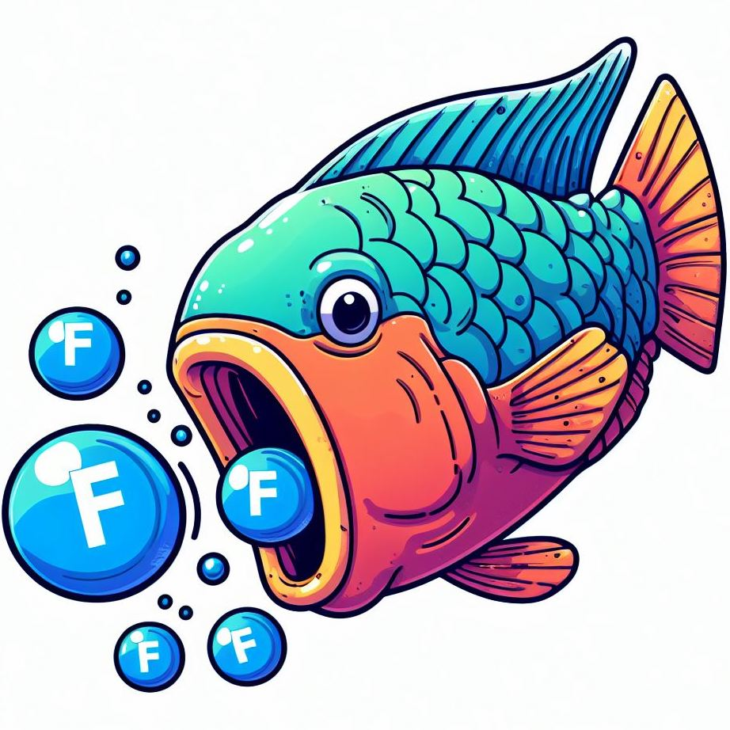

# Parrotfish


<sup>Image made by Bing Image Creator powered by DALL·E 3. [Generated with AI ∙ October 10, 2023 at 5:09 p.m] </sup>
<br><br>
Parrotfish is a tool for optimizing configuration of serverless functions using parametric regression.
You can learn more about the architecture and performance of Parrotfish in our recent 2023 ACM Symposium on Cloud Computing (SoCC '23) paper: https://cirrus.ece.ubc.ca/papers/socc23_parrotfish.pdf

## Setup

### Requirements
- Python 3
- AWS CLI (configured with `aws configure`)
- MongoDB (by default, accessible on `localhost:27017`)

### Steps
1. Create and activate a virtualenv.
```bash
python3 -m venv src-env
source src-env/bin/activate
```

2. Install required packages.
```
pip install -r requirements.txt
```

3. Install SPOT as an editable package.
```bash
pip install -e .
```

4. Run it!
```bash
parrotfish
```

## Running new benchmark fucntions
### Add a new function
Follow the instructions [here](src/serverless_functions/README.md)
### Prepare and train
1. Profile to get initial data 
```bash
parrotfish <function_name> -p
```
2. fetch new logs from CloudWatch
```bash
parrotfish <function_name> -f
```
3. train with selected model
```bash
parrotfish <function_name> -tm polynomial
```
4. You can get recommendation without updating config file at or after the previous step with `-r`
5. update the config file and calculate error rate
```bash
parrotfish -um polynomial
```
Graphs for error and prediction vs epoch can be found corresponding folders in `serverless_functions/<function>/`

### Profiling alternative
To invoke only with the configurations defined in `config.json`, use `-i` flag
```bash
parrotfish <function_name> -i
```

## Acknowledgments

This work was supported by the Natural Sciences and Engineering Research Council of Canada (NSERC), Mitacs, and The University of British Columbia (UBC).
This work was enabled by cloud resources made available to us by the Digital Research Alliance of Canada, the Google Cloud Research Credits program, and the AWS Cloud Credit for Research program.
