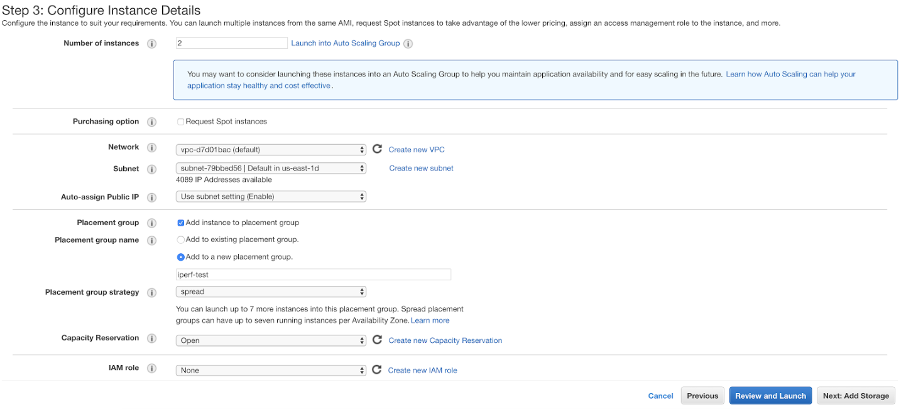
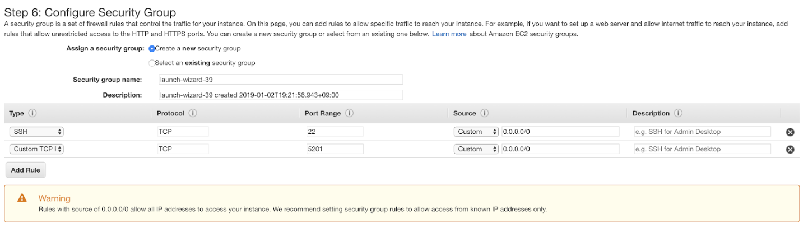
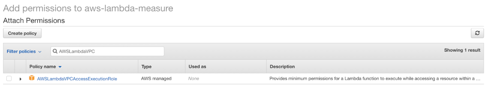
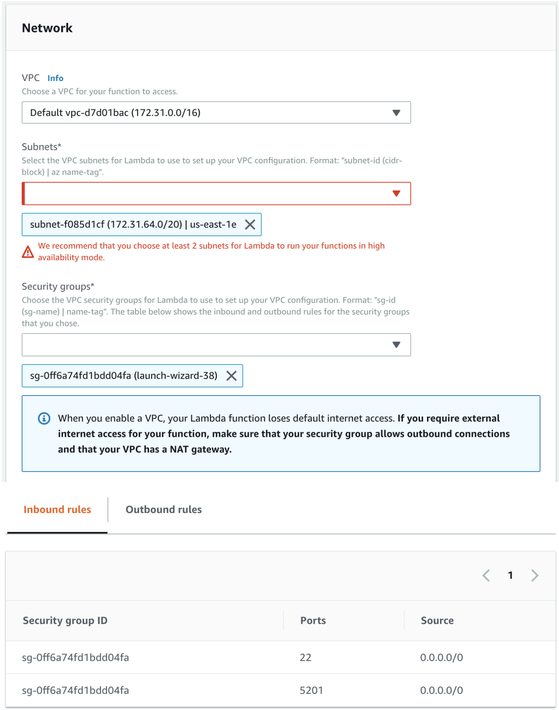

This README from https://github.com/kmu-bigdata/serverless-faas-workbench/wiki/iperf3
## Network - iperf3

**Library** : subprocess

**EC2 Setting**
1. Start your EC2 instance, Configure EC2 Network and Subnet(same Lambda functions)

2. Configure your Security Group

3. Check your EC2 internal-ip (ex : 172.31.XX.XX)
4. Install iperf3
```bash
sudo yum -y install iperf3
```
5. Start iperf3 server
default port : 5201
```bash
sudo iperf3 -s -p [PORT]
```
6. Check your Lambda VPC Permission
AWSLambdaVPCAccessExecutionRole


7. Config your Lambda Network



**Lambda payload**(test-event) example:

[iperf3 doc](https://iperf.fr/iperf-doc.php)

server_ip : EC2 internal ip 

server_port : iperf3 server port

reverse options : True or False
 - We can let a client(Lambda) work as either a data uploader(default / False) or downloader(with -R options / True).
 - True : downloader
 - False : uploader

test_time : Sets the interval time in seconds between periodic bandwidth, jitter, and loss reports. 

```json
{
    "server_ip": [SERVER_IP],
    "server_port": [SERVER_PORT],
    "test_time": [NUMBER_OF_TEST_TIME],
    "reverse" : [REVERSE_OPTION] 
```

**Lambda Output** : network sender and recevier bandwidth
